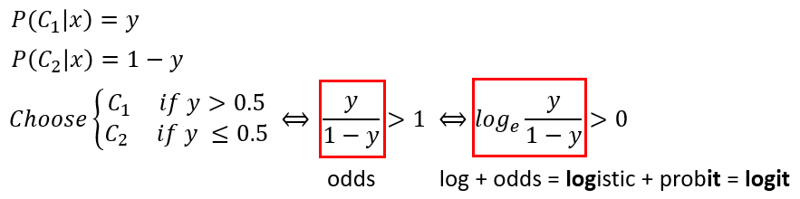
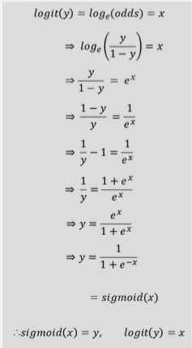
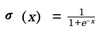
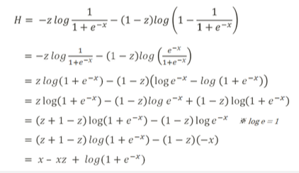
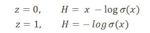
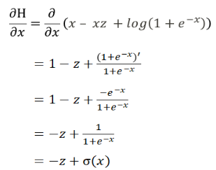
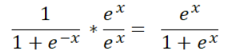
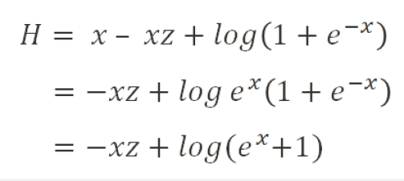
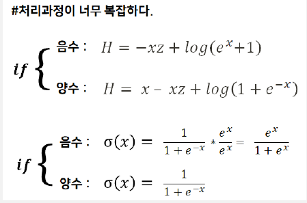
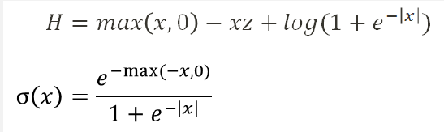

# 이진 판단 (Binary Classification) 개념


## 이진 판단에 활성화함수 도입 이유

Q1. 이진판단을 쉽게 해결하기 위한 방법이 뭐가 있을까? 값 2개를 출력해서 비교해보면 되지 않을까?

A1. 앞서 우리가 배운 퍼셉트론의 선형 연산은 하나의 값만 출력해서 2개의 값 출력할 수가 없어

<br>


Q2. 그럼 임계치를 설정해서 선형 연산 결과가 이 값을 넘는지에 따라 하나의 값을 선택해 출력하면 되지 않을까?

A2. 그 방법은 미분이 불가능해 → 그럼 역전파 과정을 수행할 수 없어 파라미터(가중치, 편향) 갱신이 안되겠지? 

<br>


Q3. 그럼 신경망 연산 결과로 확률에 해당하는 값을 추정하고, 

이 값이 1에 가까우면 참, 0에 가까우면 거짓으로 선택하면 되지 않을까?

A3. 선형 연산 결과값 자체는 (-inf, inf) 라서  0~1 사이의 값으로 제한할 수가 없어

<br>


⇒ 결국! 

선형 연산에서는 범위의 제한이 없는 실숫값 계산 + 이후 `비선형 활성화 함수` 이용

비선형 활성화 함수로 실숫값을 0~1 사이의 값(확률값의 성질)을 갖도록 변환!

그렇다면 이진 판단에서는 비선형 활성화 함수 → 시그모이드 사용!

그렇다면 파라미터를 갱신할 손실함수는? → 교차 엔트로피 사용!

EX) 회귀분석에서는 MSE(평균제곱오차) 사용

# 시그모이드 함수

$$
\sigma(x)
$$

$\sigma(x)$ : 이진 판단에서 사용하는 활성화함수

## logit = log + odds

## Odds

: **성공확률이 실패확률에 비해 얼마나 더 큰지**를 설명

즉, odds가 클수록 성공확률이 크다는 것을 의미



EX) 경마에서 특정 말이 이길 확률이 75%라고 한다면,

odds = 0.75 / 0.25 = 3 

→ 정수 표현을 이용한다면 3:1과 같이 표현가능, 즉 4게임 중에 3게임은 이기고 1게임은 진다는 의미

## Logit

logit의 장점 → 넓은 범위의 값을 간단하게 표현 가능, 변화량보다는 비율 관점에서 더 민감하게 포착 가능



→ 로짓함수와 시그모이드함수는 `역함수` 관계

[로짓과 시그모이드 개념에 대한 자세한 설명](https://chacha95.github.io/2019-04-04-logit/)

# 교차 엔트로피

: 이진 판단에서 사용하는 손실 함수

## 엔트로피

[[딥 러닝] 4강. 정보이론 기초, Entropy & Cross-entropy & KL-divergence](https://www.youtube.com/watch?v=z1k8HVU4Mxc)

단위 정보 수 ^ 정보량 = 표현 범위

즉, 전구 4개로 표현한다면 $2^4$ = 16 

→ $4 = log_2 16$ ⇒ 정보량 = log_단위 정보수 (표현범위)

$H(x)=−∑p(x_i)log_2p(x_i)$

→ 로그의 밑이 2인 경우 단위를 섀년 또는 비트라고 함 

$H(x)=−∑p(x_i)logp(x_i)$

→ 밑이 자연상수인 경우는 내트라고 함

⇒ **정보 엔트로피**: 정보량의 평균(기댓값), 어떤 확률 분포로 일어나는 사건을 표현하는데 `필요한 정보량` 

따라서 값이 🔝 → 필요한 정보량 🔝 → 확률분포의 불확실성 🔝

$H(x)=−∑p(x_i)logp(x_i)$ : 정보량의 가중평균

따라서,

$p(x_i)$ ⇒ 가중평균 계산에 사용되는 확률분포(하나의 정보량이 나올 확률?)

$−logp(x_i)$ ⇒ 정보량을 제공하는 확률분포( $p(x_i)$ 의 정보량)

## 교차 엔트로피

$H(P, Q)=−∑p(x_i)logq(x_i)$

$logp(x_i)$  ➡️   $logq(x_i)$ 로 바꾸어줌

- $-logp(x_i)$ : 하나의 $p(x_i)$ 항에 대한 정보량

    ⇒  $-logq(x_i)$ [즉, **딥러닝이 예측한 정보량?**]으로 바꾸어주면, 

    $-logq(xi)$ : 하나의 $q(x_i)$ 항에 대한 정보량 = 틀릴 수 있는 정보의 양

$H(x)=−∑p(x_i)logq(x_i)$ → **틀릴 수 있는 정보의 평균**

𝐶𝑟𝑜𝑠𝑠𝐸𝑛𝑡𝑟𝑜𝑝𝑦(𝑃,𝑄) ≥ 𝐸𝑛𝑡𝑟𝑜𝑝𝑦(𝑃,𝑃 )

교차 엔트로피의 범위는 무한대까지 가능하지만, 학습이 진행되면서 `엔트로피 값에 수렴`하는 것을 목적

교차 엔트로피에 대한 설명 + 예시 :  [https://gnoej671.tistory.com/26](https://gnoej671.tistory.com/26)

엔트로피와 교차 엔트로피에 대한 자세한 설명 :  [http://melonicedlatte.com/machinelearning/2019/12/20/204900.html](http://melonicedlatte.com/machinelearning/2019/12/20/204900.html)

추후에 참고할 사이트 (로짓, 시그모이드, 소프트맥스) :

[https://opentutorials.org/module/3653/22995](https://opentutorials.org/module/3653/22995)

# 시그모이드 & 교차 엔트로피

이진 판단 문제에 대한 정답으로 $z$가 주어졌을 때, ($z$는 0 또는 1 가능)

데이터의 결과가 *참일 확률* :  $P_T =z$ 

데이터의 결과가 *거짓일 확률* : $P_F = 1-z$

---

**신경망 예측에 대한 확률값**은 (이진 판단 문제에서 활성화함수로 시그모이드 함수를 사용하니까?)

$Q_T =\sigma(x)$ ,  $Q_F = 1-\sigma(x)$

---

⇒ 교차 엔트로피 값 : 

$H(P, Q)=−∑p(x_i)logq(x_i)$ $= -zlog\sigma(x) -(1-z)log(1-\sigma(x))$



위의 식을 대입하면

→ 



→ 이진 판단에서는 z = 0 or z = 1



→ H의 편미분



[+) 시그모이드 미분](https://en.m.wikipedia.org/wiki/Logistic_function#Derivative)

# 오버플로우 문제 해결

## 시그모이드

```python
import numpy as np

def sigmoid(x):
  y = 1.0 / (1.0 + np.exp(-x))
  return y

print(sigmoid(-1000))
# 음수값 들어갔을 때 overflow 경고문 발생
```

```
-> 출력값 (overflow 경고문 발생)
0.0
/usr/local/lib/python3.6/dist-packages/ipykernel_launcher.py:4: RuntimeWarning: overflow encountered in exp
  after removing the cwd from sys.path.
```

```python
print(sigmoid(1000))
# -> 출력값 : 1.0 (정상적으로 나옴)
```

→  식 변경



```python
def sigmoid(x):
  y = np.exp(x) / (1.0 + np.exp(x))
  return y

sigmoid(-1000)
# 출력값 -> 0.0 (정상적으로 나옴)
```

## 교차엔트로피

```python
def crossentropy(x):
  return np.log(1+np.exp(-x))

crossentropy(-1000)
# 출력값 -> inf(경고문 발생)
# /usr/local/lib/python3.6/dist-packages/ipykernel_launcher.py:2: RuntimeWarning: overflow encountered in exp
```

→ 식 변경



```python
def crossentropy(x):
  return -x + np.log(np.exp(x) + 1)

crossentropy(-1000)
# 출력값 : 1000.0(정상적으로 나옴)
```

하지만, 이러한 식 변형은 x가 음수일때만 해줘야함. 양수일때는 본래의 식을 사용 



→ 처리 과정이 복잡해 아래의 식으로 변경해줌 

⇒ max 함수와 절대값을 이용해 쉽게 적용할 수 있다.



